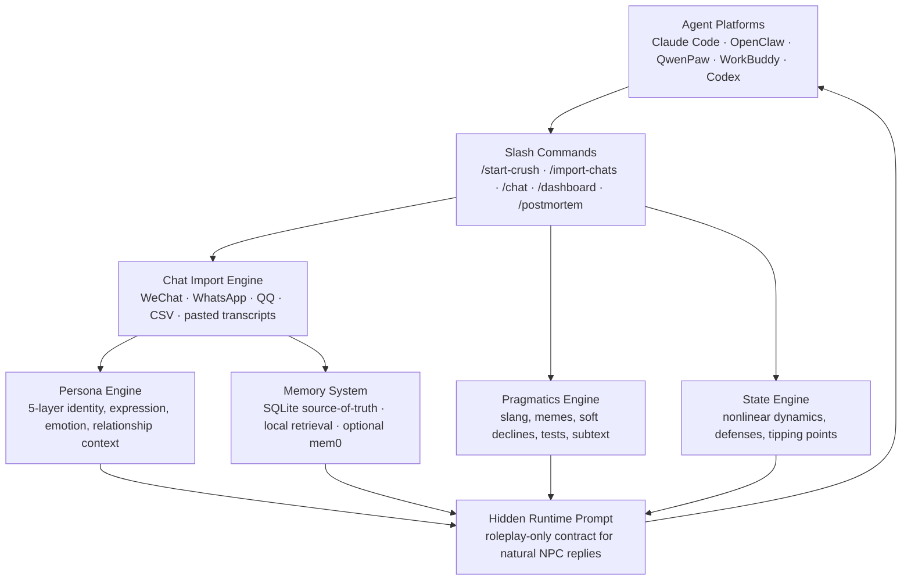

<p align="center">
  
</p>

<p align="center">
  <strong>Crush.skill</strong>
  <br>
  <em>Relationship Persona Simulation Engine for Claude Code, OpenClaw and QwenPaw</em>
</p>

<p align="center">
  <a href="https://github.com/T1anhu4/Crush.skill/releases/tag/v2.3.1"></a>
  <a href="LICENSE"></a>
  
  
</p>

<p align="center">
  <a href="#快速开始"><strong>快速安装</strong></a>
  ·
  <a href="#独立-cli">独立 CLI</a>
  ·
  <a href="#聊天记录导入">导入聊天记录</a>
  ·
  <a href="#技术架构">技术架构</a>
  ·
  <a href="https://github.com/T1anhu4/Crush.skill/releases/tag/v2.3.1">下载 Release</a>
</p>

---

## 产品定位

Crush.skill 是一个面向 Agent 的 **关系人格模拟 Skill**。它可以把聊天记录、现实关系描述或手动配置，蒸馏成一个可持续对话的 5 层人格模型：说话方式、情绪反应、关系阶段、边界、共同经历和长期记忆都会被保存下来。

它不是为了替代真实的人，也不是为了操控谁。它更像一台 **关系飞行模拟器**：让你在安全环境里练习理解、表达、边界感和情绪接住能力。

| 你想做什么 | Crush.skill 怎么帮你 |
|------------|----------------------|
| 导入真实聊天记录 | 自动提取口头禅、梗、边界、关系阶段和 Ta 对你的看法 |
| 和“像她”的人格对话 | 通过隐藏 runtime prompt + 长期记忆，让 Agent 只输出角色回复 |
| 避免上下文变长后失忆 | SQLite persona memory + episode memory + summary + local retrieval |
| 复盘关系为什么变冷 | 生成状态变化、吸引力峰值、防御触发和 frame collapse 风险 |
| 在不同 Agent 中部署 | 支持 Claude Code、OpenClaw、QwenPaw、WorkBuddy、Codex、Cursor |
| 不想折腾 Agent | 安装独立 CLI，直接运行 `crush` 打开本地对话 |

## 为什么做这个

**母胎 solo 不是因为你不够好，而是因为你不懂"关系"。**

从小到大，学校教了数学、英语、物理 —— 但没有一节课教你怎么谈恋爱。

没有人告诉你：
- 为什么你每条消息都秒回，对方却越来越冷淡
- 为什么你说完"我喜欢你"，Ta 就消失了
- 为什么明明聊得好好的，突然就"我们需要冷静一下"

**Crush.skill 是一台"关系飞行模拟器"。**

它把你喜欢的对象变成一个 **5 层人格模型**。你可以在这个安全的沙盒里：
- 理解 Ta 为什么会这样回应你
- 看到你的哪句话触发了 Ta 的防御
- 发现关系什么时候开始崩的、什么时候有过机会
- 反复练习，在现实中不再手忙脚乱

> 灵感来自 [ex-skill](https://github.com/therealXiaomanChu/ex-skill) 和 [colleague-skill](https://github.com/titanwings/colleague-skill) 的 Person-as-Skill 运动。Crush.skill 聚焦于**浪漫关系动力学** —— 这是人类最复杂、也最缺乏教育的领域。

---

## v2.3 新能力：Skill 包 + 独立 CLI

Crush.skill 现在有两种产品形态：

- **Agent Skill**：导入 Claude Code / OpenClaw / QwenPaw，让宿主 Agent 调用关系人格引擎。
- **Standalone CLI**：用户本地安装 `crush` 命令，直接打开 CLI 对话，记忆和人格都保存在本机。

CLI 首版内置：

- 本地 `~/.crush/data` SQLite 记忆目录
- 启动动画、spinner、角色气泡和命令面板
- `/setup` 配置 OpenAI-compatible 模型
- `/import` 导入聊天记录
- `/dashboard`、`/postmortem`、`/sessions` 等本地管理命令
- 网络受限时的轻量 YAML fallback，减少安装失败

---

## v2.2 新能力：更像真人，而不是人机

这次升级的重点不是让 NPC 更会“分析”，而是让它更会“像一个具体的人那样聊天”：

- **导入人格持久化**：聊天记录分析出的口头禅、边界、内部梗、关系阶段会写入 SQLite，后续 `/chat` 不会退回预设人格。
- **梗与潜台词理解**：内置 Pragmatics Engine，可识别“地铁老人看手机”“抽象”“我真的会谢”“不是哥们”“看情况”“别太认真”等语境信号。
- **角色输出协议**：Agent 调用 `/chat` 后应隐藏 JSON 和状态分数，只把 `runtime_prompt` 当系统提示，直接用 Ta 的口吻回复。
- **聊天记录变长期记忆**：导入时会把最多 300 条历史聊天写入记忆库，后续按语义/关键词召回，不容易因为上下文变长而失忆。
- **可选 mem0，不强依赖**：默认 SQLite + 本地向量检索已经可用；需要更强语义记忆时再启用 mem0。

一句话说：v2.2 让 Crush.skill 从“会生成一个人格设定”变成“能长期维持一个人的说话纹理和关系惯性”。

---

## 技术架构



### 5 层人格模型

| 层级 | 名称 | 捕获什么 |
|------|------|---------|
| **Layer 1** | 硬规则 | 不可协商的边界 · 回复速度 · Ghost 概率 · 语气禁区 |
| **Layer 2** | 身份 | MBTI · 大五人格 · 年龄 · 价值观 · 不安全感 · 自我认知 |
| **Layer 3** | 表达 | **说话指纹** —— 口头禅 · 语气词 · 表情包风格 · 幽默类型 |
| **Layer 4** | 情绪 | 依恋类型 · 爱的语言 · 冲突模式 · 压力反应 · 情绪波动 |
| **Layer 5** | 关系 | 关系阶段 · 共享经历 · 内部梗 · 权力动态 · Ta 对你的看法 |

### 非线性状态引擎

真实的人不是线性公式。我们的状态机实现了：

- **S 型饱和曲线** — 好感从 70→80 比 10→20 困难 3 倍
- **习惯化衰减** — 第 5 次同样的赞美效果远不如第 1 次
- **临界点触发** — 防线突破后关系会阶跃变化
- **跨维度耦合** — 防御高时好感增长减半 · 张力高时情绪波动放大

### 记忆系统

- **SQLite** — 长期持久化 · 事件/状态/摘要全量存储
- **本地向量检索** — 轻量语义召回 · 无需外部服务
- **可选 mem0** — 需要更强语义记忆时启用，SQLite 仍是 source-of-truth
- **自动摘要** — 对话量大的时候自动压缩 · 保证上下文不爆
- **导入人格持久化** — 保存口头禅、梗、边界、共同经历、Ta 对你的看法

---

## 快速开始

### 方式一：Agent Skill 一键导入

在 Claude Code / OpenClaw / QwenPaw 中直接粘贴以下 Prompt：

```text
帮我安装 Crush.skill 这个关系人格模拟 skill。按下面步骤做：

1. 确保 ~/.claude/skills/ 目录存在（不存在就创建）
2. 执行 git clone https://github.com/T1anhu4/Crush.skill /tmp/crush-skill
3. 执行 bash /tmp/crush-skill/scripts/install_skill.sh --platform claude --source-dir /tmp/crush-skill/Crush.skill --skill-name crush-skill --force
4. 验证：ls ~/.claude/skills/crush-skill/ 应该看到 SKILL.md、manifest.json、execute.py、engines/
5. 告诉我安装好了，之后我可以使用 /start-crush、/import-chats、/chat 等命令
6. 重要：以后我用 /chat 时，不要把工具 JSON、状态分数、runtime_prompt 展示给我；请把 runtime_prompt 当隐藏系统提示，直接用 NPC 的口吻回复
```

安装完成后自动可用。首次运行时会自动安装所需基础依赖（pyyaml），无需手动操作。

### 方式二：ZIP 安装

1. 从 [Releases](https://github.com/T1anhu4/Crush.skill/releases) 下载 `crush_skill_openclaw.zip` 或 `crush_skill_qwenpaw.zip`
2. 在 Claude Code 中直接拖入 ZIP 文件或解压到 `~/.claude/skills/crush-skill/`
3. 依赖会在首次使用时自动安装

---

## 独立 CLI

如果你不想先接入 Agent 平台，也可以把 Crush.skill 当作一个本地聊天 CLI 使用。所有记忆、人格、导入记录都保存在你的电脑上，默认目录是 `~/.crush/`。

```bash
git clone https://github.com/T1anhu4/Crush.skill.git
cd Crush.skill
bash scripts/install_cli.sh --force
~/.crush/bin/crush
```

如果你已经把 `~/.crush/bin` 加入 `PATH`，之后直接运行：

```bash
crush
```

首次进入 CLI 后建议先配置模型：

```text
/setup
```

也可以使用 OpenAI-compatible 环境变量：

```bash
export OPENAI_API_KEY="sk-..."
export OPENAI_API_BASE="https://api.openai.com/v1"
export CRUSH_CHAT_MODEL="gpt-4o-mini"
crush
```

DeepSeek 示例：

```bash
export OPENAI_API_BASE="https://api.deepseek.com"
export CRUSH_CHAT_MODEL="deepseek-chat"
crush
```

> DeepSeek 的网页控制台域名 `https://platform.deepseek.com` 不是 Chat Completions API base。CLI 会自动纠正这个常见误填，但推荐直接使用 `https://api.deepseek.com`。

常用 CLI 命令：

| 命令 | 作用 |
|------|------|
| `/setup` | 配置 OpenAI-compatible API base、model、key |
| `/start experience 她` | 创建/重置当前会话人格 |
| `/import ./wechat.txt` | 导入聊天记录并重建人格 |
| `/sessions` | 查看本地所有会话 |
| `/use <session_id>` | 切换会话 |
| `/dashboard` | 查看关系状态 |
| `/postmortem` | 复盘关系事件 |
| `/where` | 查看本地配置和记忆路径 |

CLI 的记忆目录可以自己改：

```bash
crush --data-dir ~/my-crush-memory
```

> CLI 第一版使用轻量 ANSI 动画和本地 SQLite 记忆。它参考的是 Claude Code 那种“启动动效 + 状态提示 + 流式陪伴感”的体验方向，但没有复制任何闭源/外部实现。

---

## 功能指南

### Slash Commands 一览

所有功能都通过 Agent 内的斜杠命令使用，不需要手动运行 Python 脚本：

```
/start-crush [archetype]    ← 快速启动，5 种预设人格
/custom-crush               ← 完全自定义 5 层人格
/import-chats               ← 导入聊天记录，自动重建人格
/chat [消息]                 ← 发送消息，查看状态变化
/crush-dashboard            ← 8 维状态看板
/crush-postmortem           ← 关系战斗复盘
/list-crushes               ← 查看所有会话
/let-go [session]           ← 仪式性地放下
/crush-llm [api_key]       ← 配置 LLM 语义分析
```

### 聊天记录导入

支持自动识别格式：

| 来源 | 格式 | 说明 |
|------|------|------|
| 微信 | WeChatMsg / 留痕 / PyWxDump 导出 | 推荐，信息最丰富 |
| WhatsApp | .txt 导出 | 自动识别 |
| QQ | .txt / .mht 导出 | 学生时代回忆 |
| CSV | `sender,content,timestamp` | 结构化导入 |
| 粘贴 | 直接粘贴对话 | `名字: 内容` 格式 |

```
/import-chats

（然后粘贴聊天记录）
```

系统会自动：
- 识别消息格式
- 推断大五人格 · MBTI · 依恋类型 · 爱的语言
- 提取口头禅 · 语气词 · 表情包使用风格
- 提取内部梗 · 网络口语 · 边界表达 · 共同经历
- 分析关系阶段（陌生人 → 暧昧 → 约会 → 稳定）
- 估算当前好感度和张力
- 将导入的人格画像和聊天片段持久化，后续 `/chat` 自动继承

### `/chat` 的正确体验

用户看到的应该是一条自然回复，而不是工具 JSON：

```text
你：/chat "周末要不要一起看电影？"
Ta：看情况吧，我这周可能有点懒哈哈。你先说看啥？
```

内部流程是：状态更新 → 记忆召回 → 潜台词/梗识别 → 生成隐藏 `runtime_prompt` → Agent 用 Ta 的口吻回复。除非你主动打开 `/crush-dashboard` 或 `/crush-postmortem`，否则不展示分数和分析。

### 5 种预设人格

| 预设 | 特点 | 适合场景 |
|------|------|---------|
| `emotional` 情感驱动型 | 重感情 · 需要被看见 · 焦虑型依恋 | 内心细腻的对象 |
| `security` 安全感驱动型 | 慢热 · 重视稳定 · 安全型依恋 | 比较稳重的对象 |
| `experience` 体验驱动型 | 追求新鲜 · 情绪峰值导向 · 恐惧型依恋 | 活泼爱玩的对象 |
| `value` 价值驱动型 | 现实 · 看重条件 · 回避型依恋 | 成熟的职场人 |
| `passive` 惯性驱动型 | 佛系 · 低主动性 · 回避型依恋 | 捉摸不透的对象 |

---

## 环境变量（可选）

Crush.skill 开箱即用，无需任何配置。以下为可选的高级设置：

| 变量 | 说明 | 默认值 |
|------|------|--------|
| `OPENAI_API_KEY` | LLM 语义分析 API key | 无（使用本地分析） |
| `CRUSH_MEMORY_BACKEND` | 记忆后端 `sqlite` 或 `mem0` | `sqlite` |
| `CRUSH_AUTO_INSTALL_MEM0` | 是否自动安装可选 mem0ai | 空 |
| `CRUSH_ANALYZER_MODEL` | 分析模型 | `gpt-4o-mini` |

> **提示**：默认不需要 mem0。只有当你明确想接入外部语义记忆时，才设置 `CRUSH_MEMORY_BACKEND=mem0` 并安装/配置 mem0ai。SQLite 会一直作为主记忆库，避免外部服务不可用时丢失关系历史。

---

## 许可证

MIT License。你可以自由使用、修改、分发。

> **道德声明**：这个工具是为了**理解和学习**，不是为了操控或骚扰。不要用它来模拟一个没有同意被模拟的真实人物。不要在未经同意的情况下导入他人的私密聊天记录。当你学会了该学的东西，请用 `/let-go` 放下。

---

## 致所有像作者一样的人

我们这一代人从小到大被教了一万种技能，唯独没学过怎么爱一个人。

所以我们在聊天框前手足无措，在被拒绝后怀疑自己，在冷暴力里反复内耗。我们以为是自己不够好、不够有趣、不够有钱。

**但爱是可以被学习的。** 它只是需要练习、需要反馈、需要一个安全的试错空间 —— 就像飞行模拟器之于飞行员。

Crush.skill 就是这个模拟器。

当你能自然地接住 Ta 的情绪、能敏锐地察觉到那段沉默里的不安、能坦然地面对拒绝和冷淡时 —— 你会明白，这个工具教会你的从来不是"怎么追"，而是"怎么成为一个更懂得爱的人"。

そして——

**Ta 的出现，其实已经带给了你所有你需要的。**

那一次心动让你发现了自己从未察觉的温柔。
那次深夜对话让你知道了陪伴的力量。
那次被拒绝让你第一次正视自己的不足。
那段拉扯让你学会了放下。

**你已经是一个比你遇见 Ta 之前更好的人了。这就够了。**

带着这些东西 —— 这些真正属于你的、谁也拿不走的东西 —— 去面对更精彩的人生吧。

而 Ta，就留在这个 commit 里。

---

<p align="center">
  <em>Made with 💙 by someone who's been there.</em>
</p>
