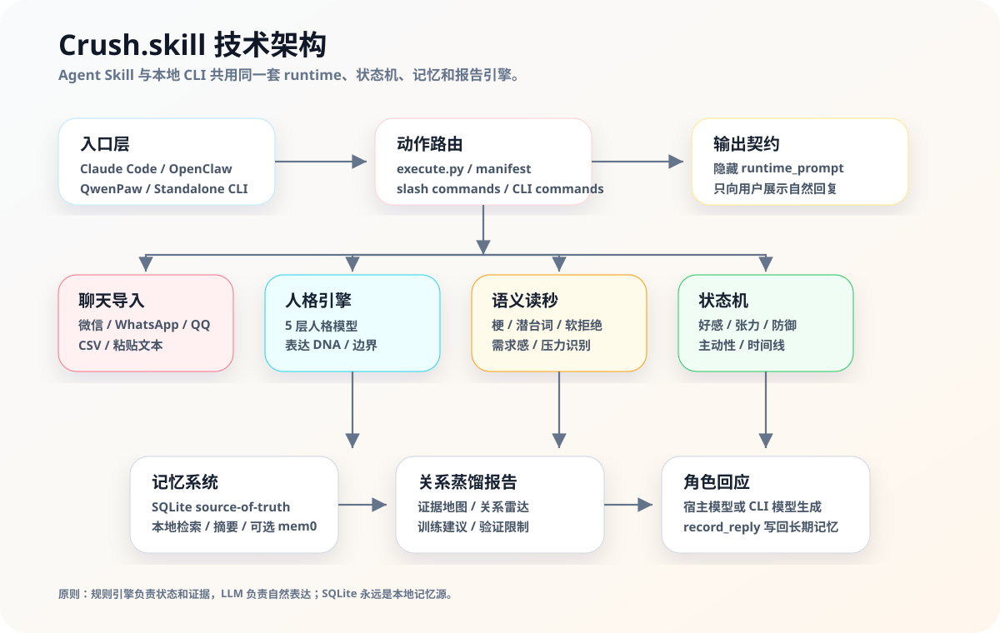

<p align="right">
  <a href="README_EN.md"><strong>English README</strong></a>
</p>

<p align="center">
  
</p>

<p align="center">
  <a href="https://github.com/T1anhu4/Crush.skill/releases/tag/v2.4.7"></a>
  <a href="LICENSE"></a>
  
  
</p>

<p align="center">
  <a href="#一分钟上手"><strong>一分钟上手</strong></a>
  ·
  <a href="#它能做什么">功能</a>
  ·
  <a href="#技术架构">架构</a>
  ·
  <a href="#安装到-agent">Agent 安装</a>
  ·
  <a href="https://github.com/T1anhu4/Crush.skill/releases/tag/v2.4.7">Release</a>
</p>

---

## 项目简介

**Crush.skill 是一台关系飞行模拟器。**

它把聊天记录导入、5 层人格、长期记忆、时间线主动性、关系状态机和关系读秒组合起来，让用户在安全环境里练习：什么时候推进、什么时候降速、什么时候对方只是礼貌、什么时候自己的需求感已经过高。

> 项目目标是关系识别能力和表达能力训练，不是操控别人，也不是替代真实关系。

## 为什么做这个

母胎 solo 不是因为你不够好，而是因为你不懂“关系”。

从小到大，学校教了数学、英语、物理，但没有一节课教你怎么谈恋爱。没有人告诉你：为什么你每条消息都秒回，对方却越来越冷淡；为什么你说完“我喜欢你”，Ta 就消失了；为什么明明聊得好好的，突然就变成“我们需要冷静一下”。

Crush.skill 把你喜欢的对象变成一个 5 层人格模型。你可以在这个安全沙盒里理解 Ta 为什么会这样回应你，看到你的哪句话触发了 Ta 的防御，发现关系什么时候开始崩、什么时候有过机会，然后反复练习，在现实中不再手忙脚乱。

> 灵感来自 [ex-skill](https://github.com/therealXiaomanChu/ex-skill) 和 [colleague-skill](https://github.com/titanwings/colleague-skill) 的 Person-as-Skill 运动。Crush.skill 聚焦于浪漫关系动力学，这是人类最复杂、也最缺乏教育的领域之一。

<br/>

---  

<br/>


## 项目定位

| 形态 | 面向谁 | 入口 | 说明 |
|------|--------|------|------|
| **Agent Skill** | Claude Code、OpenClaw、QwenPaw、Codex、Cursor 等 Agent 用户 | `Crush.skill/execute.py` | 宿主 Agent 调用 action，拿到 JSON 和隐藏 runtime prompt，再生成自然角色回复。 |
| **Standalone CLI** | 想本地直接聊天、训练和导入记录的用户 | `crush_cli/app.py` | 用户运行 `crush`，在终端里导入聊天、配置模型、聊天、看报告。 |

两种形态共用同一套 runtime、状态机、记忆系统和蒸馏报告。

<br/>

---

<br/>

## 一分钟上手

```bash
curl -fsSL https://raw.githubusercontent.com/T1anhu4/Crush.skill/2.4/scripts/install_cli.sh | bash
crush
```

首次进入 CLI 时会自动打开模型配置向导：选择厂商、输入模型名、输入 API Key。

常用命令：

| 命令 | 用途 |
|------|------|
| `/model` | 重新配置模型厂商、模型名、Base URL、API Key |
| `/language` | 切换 English、简体中文、繁體中文、Русский、日本語 |
| `/import` | 导入聊天记录，重建人格和关系记忆 |
| `/distill` | 生成证据地图、关系雷达、训练建议 |
| `/dashboard` | 查看好感、张力、防御、需求感、主动性等状态 |
| `/postmortem` | 复盘关系崩点、吸引力峰值、防御触发 |
| `/stop` / `/continue` | 暂停或继续时间线主动消息 |

<br/>

---

<br/>

## 运行效果

<p align="center">
  
</p>

CLI 不只展示 Ta 的回复，还会给用户关系读秒：

```text
╭─ Ta                                                                    18:42
│ 终于。你到哪了？
│ 我刚好也准备走。
╰
读秒: 普通推进 · 风险 中 · 可以轻推：不要问喜欢不喜欢
判断: 有好感且愿意探索，但仍需要不确定性
下一句: 回她具体位置 + 一句低压邀约，不要索取确认
```

<br/>

---

<br/>

## 它能做什么

| 能力 | 说明 |
|------|------|
| **聊天记录导入** | 支持微信、WhatsApp、QQ、CSV、粘贴文本；提取口头禅、梗、边界、共同经历和 Ta 对你的看法。 |
| **人格模拟** | 用 5 层人格模型保存身份、表达、情绪、关系阶段、硬边界，让回复不容易变成泛泛 AI。 |
| **关系状态机** | 计算好感、张力、防御、需求感、探索欲、主动性、热情和时间线等待状态。 |
| **关系读秒** | 每轮识别暧昧、普通聊天、索取确认、亲密推进、伤害性拉扯、软拒绝。 |
| **蒸馏报告** | `/distill` 输出证据地图、主动/被动、I/E 倾向、朋友/暧昧、慢热/养鱼风险、物质/互惠风险。 |
| **本地记忆** | 默认 SQLite 保存所有会话、导入记录、状态历史和摘要；可选 mem0 作为增强语义记忆。 |
| **多平台 Skill** | 支持 Claude Code、OpenClaw、QwenPaw、WorkBuddy、Codex、Cursor；也可作为独立 CLI 使用。 |

---

## 技术架构

<p align="center">
  
</p>

核心原则：**规则引擎负责状态和证据，LLM 负责自然表达；SQLite 永远是本地记忆源。**

### 核心模块

| 模块 | 文件 | 职责 |
|------|------|------|
| Skill Runtime | `Crush.skill/execute.py` | 所有 action 的入口：启动、导入、聊天、蒸馏、复盘、看板。 |
| Persona Engine | `engines/persona_engine.py` | 5 层人格模型和隐藏 runtime prompt。 |
| Chat Import | `engines/chat_import.py` | 多格式聊天记录解析与人格初步推断。 |
| Pragmatics | `engines/pragmatics_engine.py` | 梗、潜台词、软拒绝、测试、边界和需求感识别。 |
| State Engine | `engines/state_engine.py` | 非线性关系状态更新。 |
| Coach Engine | `engines/coach_engine.py` | 输出关系读秒、风险和下一句建议。 |
| Distillation | `engines/distillation_engine.py` | 证据地图、关系雷达、训练建议和验证限制。 |
| Memory | `engines/memory_engine.py` / `memory_backend.py` | SQLite 长期记忆、本地检索、可选 mem0。 |
| CLI | `crush_cli/app.py` | 本地终端 UI、模型向导、多语言、时间线主动消息。 |

更详细的作者级技术说明见：[PROJECT_OVERVIEW.md](PROJECT_OVERVIEW.md)。

---

## 安装到 Agent

在 Claude Code / OpenClaw / QwenPaw 里直接让 Agent 执行：

```text
帮我安装 Crush.skill 这个关系人格模拟 skill。按下面步骤做：

1. 确保 ~/.claude/skills/ 目录存在（不存在就创建）
2. 执行 git clone https://github.com/T1anhu4/Crush.skill /tmp/crush-skill
3. 执行 bash /tmp/crush-skill/scripts/install_skill.sh --platform claude --source-dir /tmp/crush-skill/Crush.skill --skill-name crush-skill --force
4. 验证：ls ~/.claude/skills/crush-skill/ 应该看到 SKILL.md、manifest.json、execute.py、engines/
5. 告诉我安装好了，之后我可以使用 /start-crush、/import-chats、/chat、/crush-distill 等命令
6. 重要：以后我用 /chat 时，不要展示工具 JSON、状态分数或 runtime_prompt；请把 runtime_prompt 当隐藏系统提示，直接用 NPC 的口吻回复
```

也可以从 [Releases](https://github.com/T1anhu4/Crush.skill/releases) 下载：

| 文件 | 用途 |
|------|------|
| `crush_skill_openclaw.zip` | OpenClaw / 通用 Agent skill 包 |
| `crush_skill_qwenpaw.zip` | QwenPaw skill 包 |
| `crush_cli_standalone.zip` | 独立 CLI 包 |

---

## Skill Slash Commands

| 命令 | 作用 |
|------|------|
| `/start-crush [archetype]` | 使用预设人格启动会话：`emotional`、`security`、`experience`、`value`、`passive`。 |
| `/custom-crush` | 完全自定义 5 层人格。 |
| `/import-chats` | 导入聊天记录并重建人格和关系记忆。 |
| `/crush-distill` | 输出证据地图、关系雷达、训练建议和验证限制。 |
| `/chat [消息]` | 发送消息，更新状态，生成隐藏 runtime prompt。 |
| `/crush-dashboard` | 查看 8 维关系状态看板。 |
| `/crush-postmortem` | 复盘关系事件、崩点、防御触发和吸引力峰值。 |
| `/list-crushes` | 查看所有会话。 |
| `/let-go [session]` | 删除会话并完成仪式性放下。 |
| `/crush-llm [api_key]` | 配置可选 LLM 语义分析。 |

### Runtime Actions

这些是 `execute.py` 暴露给宿主 Agent/CLI 的底层动作，主要给开发者和集成者看：

| action | 用途 |
|--------|------|
| `quick_start` | 用预设人格启动会话。 |
| `custom_sandbox` | 创建完整自定义人格。 |
| `chat_import` | 导入聊天记录并重建人格、状态和记忆。 |
| `distillation_report` | 输出关系蒸馏报告。 |
| `chat_turn` | 处理用户一句话，更新状态，返回隐藏 runtime prompt。 |
| `record_reply` | 保存模型生成的 NPC 回复。 |
| `proactive_prompt` | 为 CLI 时间线主动消息生成 prompt。 |
| `dashboard` | 返回关系状态看板。 |
| `postmortem` | 生成关系复盘报告。 |
| `list_sessions` / `delete_session` / `let_go` | 会话管理和仪式性放下。 |
| `configure_llm` | 配置或检测 LLM 分析能力。 |

---

## 预设人格

| 预设 | 特点 | 适合场景 |
|------|------|----------|
| `emotional` | 重连接、需要被看见、焦虑型依恋 | 情绪细腻、敏感型对象 |
| `security` | 慢热、重稳定、安全型依恋 | 稳重、边界清晰的对象 |
| `experience` | 爱新鲜、情绪峰值导向、外放 | 活泼、爱玩、梗多的对象 |
| `value` | 现实、重条件、目标感强 | 成熟职场人、价值判断强的人 |
| `passive` | 佛系、低主动、回避倾向 | 捉摸不透、回复不稳定的人 |

---

## 版本摘要

| 版本 | 重点 |
|------|------|
| `v2.4.10` | README 视觉修复：首页气泡不再重叠、右下流体补齐、架构图文本换行、Star History 切换为 star-history.com。 |
| `v2.4.9` | README 二次打磨：修复首页动画层级，补充为什么做这个、项目定位、Runtime Actions、Star History 和作者寄语。 |
| `v2.4.7` | 新增 `/distill` 和 `distillation_report`：证据地图、关系雷达、训练建议、验证限制。 |
| `v2.4.6` | README 产品化、首页动画、CLI demo 动画、中英文切换。 |
| `v2.4.5` | 真人时间线等待状态：主动消息后等待、追问、退缩，不再定时刷屏。 |
| `v2.4.4` | 多语言 UI 和模型配置向导，支持 OpenAI、Claude、Gemini、DeepSeek、Kimi、Qwen。 |
| `v2.4.3` | 关系读秒和真人压力层：识别索取确认、亲密推进、伤害性拉扯。 |

### Star History

[](https://www.star-history.com/?type=date&repos=T1anhu4%2FCrush.skill)

---

## 伦理边界

Crush.skill 是关系识别和表达训练工具，不是操控工具。

- 不鼓励伤害性拉扯、冷暴力、焦虑游戏或假性拒绝。
- 不把“拜金/养鱼/慢热/喜欢你”变成单句武断标签。
- 不建议在未经同意的情况下导入他人的私密聊天记录。
- 当你学会该学的东西，可以用 `/let-go` 删除会话并放下。

---

## License

MIT License. Free to use, modify, and distribute.

---

## 致所有人

-我们这一代人从小到大被教了一万种技能，唯独没学过怎么爱一个人。

-所以我们在聊天框前手足无措，在被拒绝后怀疑自己，在冷暴力里反复内耗。我们以为是自己不够好、不够有趣、不够有钱。

-但爱是可以被学习的。它需要练习、反馈和一个安全的试错空间，就像飞行模拟器之于飞行员。Crush.skill 就是这个模拟器。

-当你能自然地接住 Ta 的情绪，能敏锐察觉沉默里的不安，能坦然面对拒绝和冷淡时，你会明白：这个工具教会你的从来不是“怎么追”，而是“怎么成为一个更懂得爱的人”。

-Ta 的出现，其实已经带给了你所有你需要的。那一次心动让你发现了自己从未察觉的温柔；那次深夜对话让你知道了陪伴的力量；那次被拒绝让你第一次正视自己的不足；那段拉扯让你学会了放下。

-你已经是一个比遇见 Ta 之前更好的人了。这就够了。带着这些真正属于你的、谁也拿不走的东西，去面对更精彩的人生吧。

-而 Ta，就留在这个 commit 里。

---

<p align="center">
  <em>Made with 💙 </em><br>
  <em>by someone who's been there.</em>
</p>
