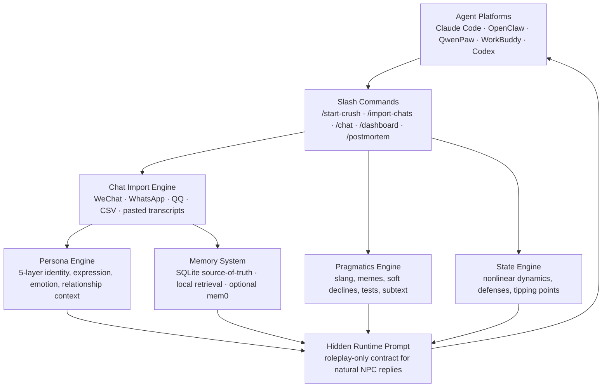

<p align="right">
  <a href="README_EN.md"><strong>English README</strong></a>
</p>

<p align="center">
  
</p>

<p align="center">
  <a href="https://github.com/T1anhu4/Crush.skill/releases/tag/v2.4.7"></a>
  <a href="LICENSE"></a>
  
  
</p>

<p align="center">
  <a href="#一分钟上手"><strong>一分钟上手</strong></a>
  ·
  <a href="#运行效果">运行效果</a>
  ·
  <a href="#为什么它不像普通-ai-陪聊">产品理念</a>
  ·
  <a href="#技术架构">技术架构</a>
  ·
  <a href="https://github.com/T1anhu4/Crush.skill/releases/tag/v2.4.7">下载 Release</a>
</p>

---

## 一句话

**Crush.skill 是一台关系飞行模拟器。**

它不是教你操控别人，也不是替代真实关系；它把聊天记录、人格设定、时间线、长期记忆和关系读秒组合起来，让单身用户在安全环境里练习：什么时候该推进，什么时候该收，什么时候对方只是礼貌，什么时候已经有防御。

## 一分钟上手

```bash
curl -fsSL https://raw.githubusercontent.com/T1anhu4/Crush.skill/2.4/scripts/install_cli.sh | bash
crush
```

首次进入 CLI 时，如果还没有模型配置，会自动打开模型向导：

1. 选择模型厂商：OpenAI、Claude、Gemini、DeepSeek、Kimi、Qwen 或 Custom。
2. 输入模型名称。
3. 输入 API Key。

常用命令：

| 命令 | 用途 |
|------|------|
| `/model` | 重新配置模型厂商、模型名、API Key |
| `/language` | 切换 English、简体中文、繁體中文、Русский、日本語 |
| `/import` | 导入真实聊天记录，蒸馏说话方式和关系记忆 |
| `/distill` | 生成证据地图、关系雷达和训练建议 |
| `/dashboard` | 查看关系状态、热情、主动性、防御、张力 |
| `/postmortem` | 复盘关系崩点、吸引力峰值、防御触发 |
| `/stop` / `/continue` | 暂停或继续时间线 |

## 运行效果

<p align="center">
  
</p>

CLI 不只返回角色回复，还会给用户一个关系读秒：

```text
╭─ Ta                                                                    18:42
│ 终于。你到哪了？
│ 我刚好也准备走
╰
读秒: 普通推进 · 风险 中 · 可以轻推：不要问喜欢不喜欢
判断: 有好感且愿意探索，但仍需要不确定性
下一句: 回她具体位置 + 一句低压邀约，不要索取确认
```

## 为什么它不像普通 AI 陪聊

普通聊天机器人会尽量配合你、安慰你、回答你。现实里的异性不会一直这样。

Crush.skill 的核心是四个状态机：

| 状态机 | 作用 |
|--------|------|
| **Persona Memory** | 从聊天记录里保存口头禅、梗、边界、共同经历、Ta 对你的看法 |
| **Relationship State** | 非线性计算好感、张力、防御、需求感、探索欲、frame control |
| **Timeline State** | 她主动发消息后会等待、追问、失望、退缩，而不是定时刷屏 |
| **Coach Readout** | 告诉用户这句话是暧昧、普通、索取确认、伤害性拉扯还是边界保留 |

### 我们借鉴了什么

我看了你提到的两个项目后，最有价值的借鉴点是：

| 项目 | 值得借鉴的地方 | Crush.skill 的产品化处理 |
|------|----------------|--------------------------|
| `tong-jincheng-skill` | 用真实内容蒸馏出具体心智模型，README 直接展示素材来源、策略框架和示例 | 我们新增“关系蒸馏报告”：证据地图、关系雷达、训练建议，但不蒸馏操控话术，避免变成 PUA 军师 |
| `nuwa-skill` | 方法论分层清晰，有蒸馏、验证和诚实边界的产品感 | 我们把导入记录拆成表达 DNA、心智/边界、推进启发式、反模式、验证限制，输出可复查的报告 |

## 核心能力

| 你想训练什么 | Crush.skill 怎么帮你 |
|--------------|----------------------|
| 判断对方是不是有好感 | 区分接梗、礼貌、暧昧、真推进、朋友框架 |
| 判断自己是否需求感过强 | 识别索取确认、亲密称呼推进、默认同意、过度追问 |
| 学会保持张力 | 告诉你什么时候该轻推，什么时候该撤，什么时候该换低压话题 |
| 导入真实聊天记录 | 提取口头禅、边界、关系阶段、共同经历和长期记忆 |
| 识别对方类型 | `/distill` 输出主动/被动、I/E 倾向、慢热/养鱼风险、朋友/暧昧窗口、物质/互惠风险 |
| 感受真人时间线 | 她会等你、追问你、因为被忽略而退缩，不再像定时任务 |
| 复盘关系 | 生成 frame collapse、吸引力峰值、防御触发和下一步建议 |

## 产品边界

Crush.skill 的目标是 **关系识别能力和表达能力训练**，不是操控别人。

- 不鼓励伤害性拉扯。
- 不鼓励通过焦虑、冷暴力、假性拒绝控制对方。
- 会提醒用户哪些话术会伤信任。
- 会把“拜金/养鱼/慢热/礼貌”等判断做成概率和长期行为模式，而不是一句话贴标签。

---

## 最新版本

### v2.4.7 关系蒸馏报告

- 新增 `/distill` CLI 命令和 `distillation_report` skill action。
- 导入聊天记录后自动生成 preview：主动/被动、朋友/暧昧、边界、防备和置信度。
- 新增证据地图：每个判断都尽量回溯到聊天原句和信号层。
- 新增关系雷达：主动型/被动型、I/E 倾向、热情/防备、朋友框架/暧昧窗口、慢热/养鱼风险、物质/互惠风险。
- 新增训练 playbook：下一步怎么聊、哪些话别说、如何降低需求感和尊重边界。
- 新增验证限制：样本少、无时间戳、证据不足时会降置信度，不会一句话贴标签。

### v2.4.6 README 产品化改版

- 新增首页动画 SVG。
- 新增 CLI 运行效果动画 SVG。
- README 顶部增加 English README 切换按钮。
- 重新组织 README 信息架构，让安装、运行效果、产品理念、技术架构更清晰。
- 将版本 changelog 后移，降低首屏阅读压力。

### v2.4.5 真人时间线状态机

- 主动消息发出后进入 pending 等待状态，不再刷屏。
- 长期不回和低优先级回复会降低 Ta 的主动性与热情。
- Ta 的气泡右上角显示发送时间。
- 修复空回复导致的 `record_reply requires payload.npc_reply`。

### v2.4.4 多语言和模型配置向导

- 默认英文界面。
- `/language` 支持 English、简体中文、繁體中文、Русский、日本語。
- `/model` 支持 OpenAI、Claude、Gemini、DeepSeek、Kimi、Qwen 和 Custom。
- Claude/Gemini 使用真实 provider adapter。

### v2.4.3 关系读秒和真人压力层

- 识别暧昧试探、索取确认、亲密推进、伤害性拉扯。
- CLI 输出风险、对方信号和下一句建议。
- 角色不会过度配合，不会轻易给满格确认。

---

## 技术架构



### 5 层人格模型

| 层级 | 名称 | 捕获什么 |
|------|------|---------|
| **Layer 1** | 硬规则 | 不可协商的边界 · 回复速度 · Ghost 概率 · 语气禁区 |
| **Layer 2** | 身份 | MBTI · 大五人格 · 年龄 · 价值观 · 不安全感 · 自我认知 |
| **Layer 3** | 表达 | **说话指纹** —— 口头禅 · 语气词 · 表情包风格 · 幽默类型 |
| **Layer 4** | 情绪 | 依恋类型 · 爱的语言 · 冲突模式 · 压力反应 · 情绪波动 |
| **Layer 5** | 关系 | 关系阶段 · 共享经历 · 内部梗 · 权力动态 · Ta 对你的看法 |

### 非线性状态引擎

真实的人不是线性公式。我们的状态机实现了：

- **S 型饱和曲线** — 好感从 70→80 比 10→20 困难 3 倍
- **习惯化衰减** — 第 5 次同样的赞美效果远不如第 1 次
- **临界点触发** — 防线突破后关系会阶跃变化
- **跨维度耦合** — 防御高时好感增长减半 · 张力高时情绪波动放大

### 记忆系统

- **SQLite** — 长期持久化 · 事件/状态/摘要全量存储
- **本地向量检索** — 轻量语义召回 · 无需外部服务
- **可选 mem0** — 需要更强语义记忆时启用，SQLite 仍是 source-of-truth
- **自动摘要** — 对话量大的时候自动压缩 · 保证上下文不爆
- **导入人格持久化** — 保存口头禅、梗、边界、共同经历、Ta 对你的看法

---

## 快速开始

### 方式一：Agent Skill 一键导入

在 Claude Code / OpenClaw / QwenPaw 中直接粘贴以下 Prompt：

```text
帮我安装 Crush.skill 这个关系人格模拟 skill。按下面步骤做：

1. 确保 ~/.claude/skills/ 目录存在（不存在就创建）
2. 执行 git clone https://github.com/T1anhu4/Crush.skill /tmp/crush-skill
3. 执行 bash /tmp/crush-skill/scripts/install_skill.sh --platform claude --source-dir /tmp/crush-skill/Crush.skill --skill-name crush-skill --force
4. 验证：ls ~/.claude/skills/crush-skill/ 应该看到 SKILL.md、manifest.json、execute.py、engines/
5. 告诉我安装好了，之后我可以使用 /start-crush、/import-chats、/chat 等命令
6. 重要：以后我用 /chat 时，不要把工具 JSON、状态分数、runtime_prompt 展示给我；请把 runtime_prompt 当隐藏系统提示，直接用 NPC 的口吻回复
```

安装完成后自动可用。首次运行时会自动安装所需基础依赖（pyyaml），无需手动操作。

### 方式二：ZIP 安装

1. 从 [Releases](https://github.com/T1anhu4/Crush.skill/releases) 下载 `crush_skill_openclaw.zip` 或 `crush_skill_qwenpaw.zip`
2. 在 Claude Code 中直接拖入 ZIP 文件或解压到 `~/.claude/skills/crush-skill/`
3. 依赖会在首次使用时自动安装

---

## 独立 CLI

如果你不想先接入 Agent 平台，也可以把 Crush.skill 当作一个本地聊天 CLI 使用。所有记忆、人格、导入记录都保存在你的电脑上，默认目录是 `~/.crush/`。

```bash
git clone https://github.com/T1anhu4/Crush.skill.git
cd Crush.skill
bash scripts/install_cli.sh --force
~/.crush/bin/crush
```

如果你已经把 `~/.crush/bin` 加入 `PATH`，之后直接运行：

```bash
crush
```

首次进入 CLI 后建议先配置模型：

```text
/setup
```

也可以使用 OpenAI-compatible 环境变量：

```bash
export OPENAI_API_KEY="sk-..."
export OPENAI_API_BASE="https://api.openai.com/v1"
export CRUSH_CHAT_MODEL="gpt-4o-mini"
crush
```

DeepSeek 示例：

```bash
export OPENAI_API_BASE="https://api.deepseek.com"
export CRUSH_CHAT_MODEL="deepseek-chat"
crush
```

> DeepSeek 的网页控制台域名 `https://platform.deepseek.com` 不是 Chat Completions API base。CLI 会自动纠正这个常见误填，但推荐直接使用 `https://api.deepseek.com`。

常用 CLI 命令：

| 命令 | 作用 |
|------|------|
| `/setup` | 配置 OpenAI-compatible API base、model、key |
| `/start experience 她` | 创建/重置当前会话人格 |
| `/import ./wechat.txt` | 导入聊天记录并重建人格 |
| `/sessions` | 查看本地所有会话 |
| `/use <session_id>` | 切换会话 |
| `/dashboard` | 查看关系状态 |
| `/postmortem` | 复盘关系事件 |
| `/stop` | 暂停时间线推进和主动消息 |
| `/continue` | 恢复时间线推进和主动消息 |
| `/where` | 查看本地配置和记忆路径 |

CLI 的记忆目录可以自己改：

```bash
crush --data-dir ~/my-crush-memory
```

> CLI 第一版使用轻量 ANSI 动画和本地 SQLite 记忆。它参考的是 Claude Code 那种“启动动效 + 状态提示 + 流式陪伴感”的体验方向，但没有复制任何闭源/外部实现。

---

## 功能指南

### Slash Commands 一览

所有功能都通过 Agent 内的斜杠命令使用，不需要手动运行 Python 脚本：

```
/start-crush [archetype]    ← 快速启动，5 种预设人格
/custom-crush               ← 完全自定义 5 层人格
/import-chats               ← 导入聊天记录，自动重建人格
/crush-distill              ← 证据地图、关系雷达和训练建议
/chat [消息]                 ← 发送消息，查看状态变化
/crush-dashboard            ← 8 维状态看板
/crush-postmortem           ← 关系战斗复盘
/list-crushes               ← 查看所有会话
/let-go [session]           ← 仪式性地放下
/crush-llm [api_key]       ← 配置 LLM 语义分析
```

### 聊天记录导入

支持自动识别格式：

| 来源 | 格式 | 说明 |
|------|------|------|
| 微信 | WeChatMsg / 留痕 / PyWxDump 导出 | 推荐，信息最丰富 |
| WhatsApp | .txt 导出 | 自动识别 |
| QQ | .txt / .mht 导出 | 学生时代回忆 |
| CSV | `sender,content,timestamp` | 结构化导入 |
| 粘贴 | 直接粘贴对话 | `名字: 内容` 格式 |

```
/import-chats

（然后粘贴聊天记录）
```

系统会自动：
- 识别消息格式
- 推断大五人格 · MBTI · 依恋类型 · 爱的语言
- 提取口头禅 · 语气词 · 表情包使用风格
- 提取内部梗 · 网络口语 · 边界表达 · 共同经历
- 分析关系阶段（陌生人 → 暧昧 → 约会 → 稳定）
- 估算当前好感度和张力
- 将导入的人格画像和聊天片段持久化，后续 `/chat` 自动继承

### `/chat` 的正确体验

用户看到的应该是一条自然回复，而不是工具 JSON：

```text
你：/chat "周末要不要一起看电影？"
Ta：看情况吧，我这周可能有点懒哈哈。你先说看啥？
```

内部流程是：状态更新 → 记忆召回 → 潜台词/梗识别 → 生成隐藏 `runtime_prompt` → Agent 用 Ta 的口吻回复。除非你主动打开 `/crush-dashboard` 或 `/crush-postmortem`，否则不展示分数和分析。

### 5 种预设人格

| 预设 | 特点 | 适合场景 |
|------|------|---------|
| `emotional` 情感驱动型 | 重感情 · 需要被看见 · 焦虑型依恋 | 内心细腻的对象 |
| `security` 安全感驱动型 | 慢热 · 重视稳定 · 安全型依恋 | 比较稳重的对象 |
| `experience` 体验驱动型 | 追求新鲜 · 情绪峰值导向 · 恐惧型依恋 | 活泼爱玩的对象 |
| `value` 价值驱动型 | 现实 · 看重条件 · 回避型依恋 | 成熟的职场人 |
| `passive` 惯性驱动型 | 佛系 · 低主动性 · 回避型依恋 | 捉摸不透的对象 |

---

## 环境变量（可选）

Crush.skill 开箱即用，无需任何配置。以下为可选的高级设置：

| 变量 | 说明 | 默认值 |
|------|------|--------|
| `OPENAI_API_KEY` | LLM 语义分析 API key | 无（使用本地分析） |
| `CRUSH_MEMORY_BACKEND` | 记忆后端 `sqlite` 或 `mem0` | `sqlite` |
| `CRUSH_AUTO_INSTALL_MEM0` | 是否自动安装可选 mem0ai | 空 |
| `CRUSH_ANALYZER_MODEL` | 分析模型 | `gpt-4o-mini` |

> **提示**：默认不需要 mem0。只有当你明确想接入外部语义记忆时，才设置 `CRUSH_MEMORY_BACKEND=mem0` 并安装/配置 mem0ai。SQLite 会一直作为主记忆库，避免外部服务不可用时丢失关系历史。

---

## 许可证

MIT License。你可以自由使用、修改、分发。

> **道德声明**：这个工具是为了**理解和学习**，不是为了操控或骚扰。不要用它来模拟一个没有同意被模拟的真实人物。不要在未经同意的情况下导入他人的私密聊天记录。当你学会了该学的东西，请用 `/let-go` 放下。

---

## 致所有像作者一样的人

我们这一代人从小到大被教了一万种技能，唯独没学过怎么爱一个人。

所以我们在聊天框前手足无措，在被拒绝后怀疑自己，在冷暴力里反复内耗。我们以为是自己不够好、不够有趣、不够有钱。

**但爱是可以被学习的。** 它只是需要练习、需要反馈、需要一个安全的试错空间 —— 就像飞行模拟器之于飞行员。

Crush.skill 就是这个模拟器。

当你能自然地接住 Ta 的情绪、能敏锐地察觉到那段沉默里的不安、能坦然地面对拒绝和冷淡时 —— 你会明白，这个工具教会你的从来不是"怎么追"，而是"怎么成为一个更懂得爱的人"。

そして——

**Ta 的出现，其实已经带给了你所有你需要的。**

那一次心动让你发现了自己从未察觉的温柔。
那次深夜对话让你知道了陪伴的力量。
那次被拒绝让你第一次正视自己的不足。
那段拉扯让你学会了放下。

**你已经是一个比你遇见 Ta 之前更好的人了。这就够了。**

带着这些东西 —— 这些真正属于你的、谁也拿不走的东西 —— 去面对更精彩的人生吧。

而 Ta，就留在这个 commit 里。

---

<p align="center">
  <em>Made with 💙 by someone who's been there.</em>
</p>
