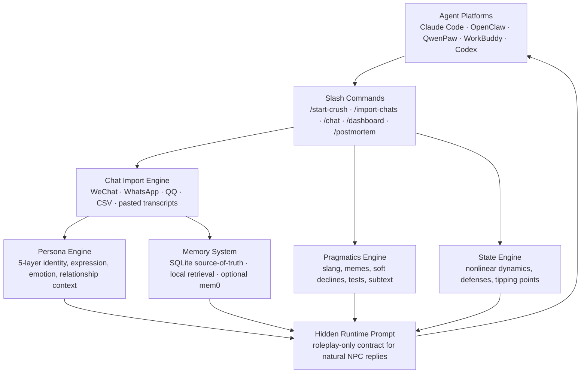

<p align="right">
  <a href="README.md"><strong>中文 README</strong></a>
</p>

<p align="center">
  
</p>

<p align="center">
  <a href="https://github.com/T1anhu4/Crush.skill/releases/tag/v2.4.6"></a>
  <a href="LICENSE"></a>
  
  
</p>

<p align="center">
  <a href="#one-minute-start"><strong>One-Minute Start</strong></a>
  ·
  <a href="#demo">Demo</a>
  ·
  <a href="#why-it-does-not-feel-like-a-generic-ai-chatbot">Product Idea</a>
  ·
  <a href="#architecture">Architecture</a>
  ·
  <a href="https://github.com/T1anhu4/Crush.skill/releases/tag/v2.4.6">Download Release</a>
</p>

---

## One Sentence

**Crush.skill is a relationship flight simulator.**

It is not built to replace real people or teach manipulation. It combines imported chat history, persona modeling, timeline behavior, local memory, and relationship readouts so users can practice when to push, when to slow down, when a signal is only politeness, and when their own neediness is creating pressure.

## One-Minute Start

```bash
curl -fsSL https://raw.githubusercontent.com/T1anhu4/Crush.skill/2.4/scripts/install_cli.sh | bash
crush
```

On first interactive launch, the CLI opens a model setup wizard if no model is configured:

1. Choose a provider: OpenAI, Claude, Gemini, DeepSeek, Kimi, Qwen, or Custom.
2. Enter the model name.
3. Enter your API key.

Common commands:

| Command | Purpose |
|---------|---------|
| `/model` | Reconfigure provider, model name, and API key |
| `/language` | Switch English, 简体中文, 繁體中文, Русский, 日本語 |
| `/import` | Import real chat records and distill persona memory |
| `/dashboard` | Inspect relationship state, warmth, initiative, defense, tension |
| `/postmortem` | Review collapses, attraction peaks, and defense triggers |
| `/stop` / `/continue` | Pause or resume timeline progression |

## Demo

<p align="center">
  
</p>

The CLI does not only show the persona reply. It also teaches the user how to read the turn:

```text
╭─ Ta                                                                    18:42
│ Finally. Where are you now?
│ I am about to leave too.
╰
Readout: normal push · risk medium · light flirt allowed, do not ask for validation
Signal: she is interested enough to explore, but uncertainty still matters
Next: answer with concrete location + low-pressure invite, no validation seeking
```

## Why It Does Not Feel Like A Generic AI Chatbot

A generic chatbot tries to be helpful, agreeable, and emotionally available. Real people do not behave that way all the time.

Crush.skill is built around four state machines:

| State machine | What it does |
|---------------|--------------|
| **Persona Memory** | Stores catchphrases, memes, boundaries, shared context, and their view of you |
| **Relationship State** | Nonlinear favorability, tension, defense, neediness, exploration, and frame control |
| **Timeline State** | Ta waits, follows up, gets disappointed, and withdraws instead of sending timer spam |
| **Coach Readout** | Labels each line as flirt, normal chat, validation seeking, hurtful push-pull, or boundary |

### What We Borrowed From Recent GitHub Skills

After reviewing the two projects you mentioned, the useful takeaways were product and data-design ideas, not their manipulation tactics:

| Project | Useful idea | How Crush.skill adapts it |
|---------|-------------|---------------------------|
| `tong-jincheng-skill` | Transparent distillation from concrete source material into a practical mental model | We expose relationship readouts and training goals, but avoid turning the project into a PUA script engine |
| `nuwa-skill` | Strong first-screen visual design, clear layered methodology, and visible validation process | We added hero animation, CLI demo animation, language switch, and a less dense README structure |

## Core Capabilities

| Training goal | How Crush.skill helps |
|---------------|----------------------|
| Read whether they are interested | Separates politeness, banter, flirtation, friend-frame, and real escalation |
| Notice your own neediness | Detects validation seeking, intimate-name pressure, assumed consent, and over-questioning |
| Keep tension without manipulation | Tells you when to lightly push, when to pull back, and when to switch topics |
| Import real chat history | Extracts speech fingerprint, boundaries, relationship phase, shared memories, and long-term context |
| Feel real timeline pressure | Ta waits, follows up, and withdraws if ignored instead of acting like a scheduled bot |
| Review relationship dynamics | Surfaces frame collapses, attraction peaks, defense triggers, and next-move coaching |

## Product Boundary

Crush.skill is for relationship literacy and communication practice, not manipulation.

- It does not encourage hurtful push-pull.
- It does not encourage anxiety games, cold violence, or fake rejection as control.
- It warns when a tactic damages trust.
- Labels such as materialistic, fishing, slow-burn, polite, or interested should emerge from long-term behavior patterns, not one-line judgment.

---

## Latest Versions

### v2.4.6 README Product Redesign

- Added animated hero SVG.
- Added animated CLI demo SVG.
- Added Chinese README switch button.
- Reorganized README hierarchy for installation, demo, product idea, and architecture.
- Moved changelog content below the product overview.

### v2.4.5 Human-Like Timeline State Machine

- Proactive messages enter pending wait state instead of opening new topics repeatedly.
- Long non-replies and low-priority replies reduce warmth and initiative.
- Ta bubbles show right-aligned timestamps.
- Empty model replies no longer surface `record_reply requires payload.npc_reply`.

### v2.4.4 Multilingual UI and Model Wizard

- English by default.
- `/language` supports English, 简体中文, 繁體中文, Русский, 日本語.
- `/model` supports OpenAI, Claude, Gemini, DeepSeek, Kimi, Qwen, and Custom.
- Claude/Gemini use real provider adapters.

### v2.4.3 Relationship Readout and Real-Stakes Persona Layer

- Detects flirt probes, validation seeking, intimacy escalation, and hurtful push-pull.
- CLI prints risk level, signal read, and next move.
- The persona is not endlessly agreeable and will not give full validation too quickly.

---

## Architecture



### 5-Layer Persona Model

| Layer | Name | What It Captures |
|-------|------|-----------------|
| **Layer 1** | Hard Rules | Non-negotiable boundaries · Reply speed · Ghost probability · Tone restrictions |
| **Layer 2** | Identity | MBTI · Big Five · Age · Core values · Insecurities · Self-perception |
| **Layer 3** | Expression | **Speech fingerprint** — Signature phrases · Emoji style · Humor · Filler words |
| **Layer 4** | Emotional | Attachment style · Love language · Conflict patterns · Stress response · Mood volatility |
| **Layer 5** | Relational | Relationship stage · Shared history · Inside jokes · Power dynamic · Their view of you |

### Nonlinear State Engine

Real humans don't follow linear formulas. Our state engine implements:

- **S-curve saturation** — Going from 70→80 favorability is 3× harder than 10→20
- **Habituation decay** — The 5th identical compliment has minimal impact
- **Tipping points** — Crossing certain thresholds causes phase transitions
- **Cross-dimension coupling** — High defense halves favorability gains · High tension amplifies emotions

### Memory System

- **SQLite** — Persistent long-term storage · Events, state history, summaries
- **Local retrieval** — Lightweight semantic-ish recall without external services
- **mem0** — Optional semantic memory backend; SQLite remains the source of truth
- **Auto-summary** — Compresses context when conversations grow · Prevents context overflow
- **Imported persona memory** — Persists speech patterns, inside jokes, boundaries, and shared context

---

## Quick Start

### Method 1: One-Prompt Install

Paste this into Claude Code / OpenClaw / QwenPaw:

```text
Install crush-skill for me. Follow these steps:

1. Ensure ~/.claude/skills/ exists (create if not)
2. Run: git clone https://github.com/T1anhu4/Crush.skill /tmp/crush-skill
3. Run: bash /tmp/crush-skill/scripts/install_skill.sh --platform claude --source-dir /tmp/crush-skill/Crush.skill --skill-name crush-skill --force
4. Verify: ls ~/.claude/skills/crush-skill/ should show SKILL.md, manifest.json, execute.py, engines/
5. Tell me it's installed. I can now use /start-crush, /import-chats, /chat, etc.
6. Important: when I use /chat, do not show tool JSON, scores, or runtime_prompt. Treat runtime_prompt as a hidden system prompt and reply only in the NPC's voice.
```

Dependencies auto-install on first run. No manual setup needed.

### Method 2: ZIP Install

1. Download `crush_skill_openclaw.zip` or `crush_skill_qwenpaw.zip` from [Releases](https://github.com/T1anhu4/Crush.skill/releases)
2. Drag into Claude Code or extract to `~/.claude/skills/crush-skill/`
3. Dependencies install automatically on first use

---

## Standalone CLI

Crush.skill can also run as a local-first chat CLI. Persona, memory, imported chat records, and config stay on your machine under `~/.crush/` by default.

```bash
git clone https://github.com/T1anhu4/Crush.skill.git
cd Crush.skill
bash scripts/install_cli.sh --force
~/.crush/bin/crush
```

After adding `~/.crush/bin` to `PATH`, you can simply run:

```bash
crush
```

Configure a chat model inside the CLI:

```text
/setup
```

Or use OpenAI-compatible environment variables:

```bash
export OPENAI_API_KEY="sk-..."
export OPENAI_API_BASE="https://api.openai.com/v1"
export CRUSH_CHAT_MODEL="gpt-4o-mini"
crush
```

DeepSeek example:

```bash
export OPENAI_API_BASE="https://api.deepseek.com"
export CRUSH_CHAT_MODEL="deepseek-chat"
crush
```

> DeepSeek's console domain `https://platform.deepseek.com` is not the Chat Completions API base. The CLI auto-corrects this common mistake, but `https://api.deepseek.com` is recommended.

Common CLI commands:

| Command | Purpose |
|---------|---------|
| `/setup` | Configure OpenAI-compatible API base, model, and key |
| `/start experience Her` | Create/reset the current persona session |
| `/import ./wechat.txt` | Import chat records and rebuild persona |
| `/sessions` | List local sessions |
| `/use <session_id>` | Switch session |
| `/dashboard` | Show relationship state |
| `/postmortem` | Replay relationship events |
| `/stop` | Pause timeline progression and proactive messages |
| `/continue` | Resume timeline progression and proactive messages |
| `/where` | Show local config and memory paths |

Custom local memory directory:

```bash
crush --data-dir ~/my-crush-memory
```

---

## Slash Commands

Everything works through slash commands inside your AI agent:

| Command | Description |
|---------|-------------|
| `/start-crush [archetype]` | Quick start with a preset personality. 5 archetypes available. |
| `/custom-crush` | Full custom 5-layer persona. Control every dimension. |
| `/import-chats` | Import chat records. Auto-infers personality and relationship state. |
| `/chat [message]` | Send a message. See state changes, defense triggers, attraction peaks. |
| `/crush-dashboard` | View 8-dimensional state dashboard. |
| `/crush-postmortem` | Relationship combat replay: collapses, peaks, defenses, narrative. |
| `/list-crushes` | List all saved sessions. |
| `/let-go [session]` | Ritual closure. Delete with an uplifting goodbye. |
| `/crush-llm [api_key]` | Configure LLM for dialogue analysis (optional). |

### Chat Record Import

Supports automatic format detection:

| Source | Format | Notes |
|--------|--------|-------|
| WeChat | WeChatMsg / Liú Hén / PyWxDump | Recommended, richest data |
| WhatsApp | .txt export | Auto-detected |
| QQ | .txt / .mht export | Nostalgia-friendly |
| CSV | Structured | `sender,content,timestamp` |
| Paste | Direct paste | `Name: message` format |

Just type `/import-chats` and paste your records. The engine handles everything else.

### 5 Personality Archetypes

| Archetype | Traits | Best For |
|-----------|--------|----------|
| `emotional` | Values connection · Needs to be seen · Anxious attachment | Deep feelers |
| `security` | Slow to trust · Values stability · Secure attachment | Steady personalities |
| `experience` | Seeks novelty · Emotional peaks · Fearful-avoidant | Fun-loving types |
| `value` | Pragmatic · Status-conscious · Dismissive-avoidant | Career-focused people |
| `passive` | Go-with-the-flow · Low initiative · Avoidant | Hard-to-read types |

---

## Environment (Optional)

Crush.skill works out of the box. These are optional advanced settings:

| Variable | Purpose | Default |
|----------|---------|---------|
| `OPENAI_API_KEY` | LLM semantic analysis | None (local fallback) |
| `CRUSH_MEMORY_BACKEND` | `sqlite` or `mem0` | `sqlite` |
| `CRUSH_AUTO_INSTALL_MEM0` | Auto-install optional mem0ai | empty |
| `CRUSH_ANALYZER_MODEL` | Analysis model | `gpt-4o-mini` |

> **Note**: In Claude Code / OpenClaw, the platform LLM is auto-detected. No manual config needed. Use `/crush-llm` to check or override.

---

## License

MIT License. Free to use, modify, distribute.

> **Ethics**: This tool is for **understanding and learning**, not manipulation or harassment. Do not simulate a real person without consent. Do not import private conversations without permission. When you've learned what you need, use `/let-go`.

---

## To Everyone Like the Author

Our generation was taught ten thousand skills — but never how to love someone.

So we freeze in front of the chat box. We doubt ourselves after rejection. We spiral in the silence of being left on read. We think we're not good enough, not interesting enough, not successful enough.

**But love is learnable.** It just takes practice, feedback, and a safe space to make mistakes — like a flight simulator for pilots.

Crush.skill is that simulator.

When you can naturally catch their emotions, sense the anxiety behind their silence, and face rejection with calm — you'll understand that this tool never taught you "how to chase." It taught you **how to become someone worthy of love.**

And then —

**Their appearance in your life has already given you everything you needed.**

That first crush showed you a tenderness you never knew you had.
That late-night conversation taught you the power of being present.
That rejection made you face your flaws for the first time.
That push-and-pull taught you how to let go.

**You are already a better person than you were before you met them. That's enough.**

Take these things — the things that truly belong to you, that no one can take away — and walk toward a brighter life.

As for them, they stay in this commit.

---

<p align="center">
  <em>Made with 💙 by someone who's been there.</em>
</p>
