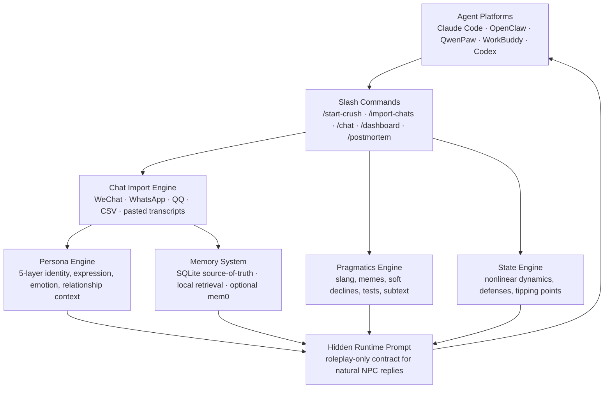

<p align="center">
  
</p>

<p align="center">
  <strong>Crush.skill</strong>
  <br>
  <em>Relationship Persona Simulation Engine for Claude Code, OpenClaw and QwenPaw</em>
</p>

<p align="center">
  <a href="https://github.com/T1anhu4/Crush.skill/releases/tag/v2.3.1"></a>
  <a href="LICENSE"></a>
  
  
</p>

<p align="center">
  <a href="#quick-start"><strong>Quick Start</strong></a>
  ·
  <a href="#standalone-cli">Standalone CLI</a>
  ·
  <a href="#chat-record-import">Chat Import</a>
  ·
  <a href="#architecture">Architecture</a>
  ·
  <a href="https://github.com/T1anhu4/Crush.skill/releases/tag/v2.3.1">Download Release</a>
</p>

---

## Product Positioning

Crush.skill is an Agent-native **relationship persona simulation skill**. It distills chat history, relationship notes, or custom configuration into a persistent 5-layer persona model: speech patterns, emotional reactions, relationship stage, boundaries, shared context, and long-term memory.

It is not a replacement for a real person, and it is not built for manipulation. Think of it as a **relationship flight simulator**: a safe place to practice understanding, expression, boundaries, and emotional presence.

| What you need | How Crush.skill helps |
|---------------|-----------------------|
| Import real chat history | Extracts catchphrases, memes, boundaries, relationship phase, and their view of you |
| Chat with a persona that feels specific | Uses hidden runtime prompts plus long-term memory so the Agent only shows in-character replies |
| Avoid context-window forgetting | Combines SQLite persona memory, episode memory, summaries, and local retrieval |
| Review why things cooled down | Surfaces state changes, attraction peaks, defense triggers, and frame-collapse risks |
| Deploy across agent platforms | Supports Claude Code, OpenClaw, QwenPaw, WorkBuddy, Codex, and Cursor |
| Skip agent setup | Install the standalone CLI and run `crush` locally |

## Why This Exists

**Being single isn't because you're not good enough. It's because nobody taught you how relationships work.**

Schools teach math, English, physics — but not a single class on love.

Nobody tells you:
- Why they grow colder the faster you reply
- Why saying "I like you" makes them disappear
- Why a great conversation suddenly becomes "we need space"

**Crush.skill is a relationship flight simulator.**

It turns the person you're interested in into a **5-layer personality model**. In this safe sandbox, you can:
- Understand why they respond the way they do
- See which of your words triggered their defenses
- Discover when the relationship started breaking — and when you had a chance
- Practice endlessly, so you're never fumbling in real life again

> Inspired by the Person-as-Skill movement — [ex-skill](https://github.com/therealXiaomanChu/ex-skill) and [colleague-skill](https://github.com/titanwings/colleague-skill). Crush.skill focuses on **romantic relationship dynamics** — the most complex and least taught domain of human interaction.

---

## v2.3: Agent Skill + Standalone CLI

Crush.skill now ships in two product forms:

- **Agent Skill**: import it into Claude Code, OpenClaw, or QwenPaw so the host Agent can call the relationship persona engine.
- **Standalone CLI**: install the local `crush` command and chat directly, with persona and memory stored on your machine.

The first CLI release includes local SQLite memory, startup animation, spinners, persona reply bubbles, `/setup`, `/import`, `/dashboard`, `/postmortem`, `/sessions`, and a lightweight YAML fallback for restricted/offline environments.

---

## v2.2: More Like a Person, Less Like a Bot

- **Imported persona persistence**: speech fingerprints, boundaries, inside jokes, and relationship context are saved to SQLite and reused in later `/chat` turns.
- **Pragmatics Engine**: recognizes slang, memes, soft declines, pacing boundaries, and relationship tests before generating the runtime prompt.
- **Roleplay-only agent protocol**: host agents should hide JSON/state data and show only the simulated person's natural reply.
- **Chat history as memory**: imported chat snippets are stored as long-term episodes and retrieved later to reduce context-window forgetting.
- **Optional mem0**: SQLite plus local retrieval works by default; mem0 is an opt-in semantic backend.

---

## Architecture



### 5-Layer Persona Model

| Layer | Name | What It Captures |
|-------|------|-----------------|
| **Layer 1** | Hard Rules | Non-negotiable boundaries · Reply speed · Ghost probability · Tone restrictions |
| **Layer 2** | Identity | MBTI · Big Five · Age · Core values · Insecurities · Self-perception |
| **Layer 3** | Expression | **Speech fingerprint** — Signature phrases · Emoji style · Humor · Filler words |
| **Layer 4** | Emotional | Attachment style · Love language · Conflict patterns · Stress response · Mood volatility |
| **Layer 5** | Relational | Relationship stage · Shared history · Inside jokes · Power dynamic · Their view of you |

### Nonlinear State Engine

Real humans don't follow linear formulas. Our state engine implements:

- **S-curve saturation** — Going from 70→80 favorability is 3× harder than 10→20
- **Habituation decay** — The 5th identical compliment has minimal impact
- **Tipping points** — Crossing certain thresholds causes phase transitions
- **Cross-dimension coupling** — High defense halves favorability gains · High tension amplifies emotions

### Memory System

- **SQLite** — Persistent long-term storage · Events, state history, summaries
- **Local retrieval** — Lightweight semantic-ish recall without external services
- **mem0** — Optional semantic memory backend; SQLite remains the source of truth
- **Auto-summary** — Compresses context when conversations grow · Prevents context overflow
- **Imported persona memory** — Persists speech patterns, inside jokes, boundaries, and shared context

---

## Quick Start

### Method 1: One-Prompt Install

Paste this into Claude Code / OpenClaw / QwenPaw:

```text
Install crush-skill for me. Follow these steps:

1. Ensure ~/.claude/skills/ exists (create if not)
2. Run: git clone https://github.com/T1anhu4/Crush.skill /tmp/crush-skill
3. Run: bash /tmp/crush-skill/scripts/install_skill.sh --platform claude --source-dir /tmp/crush-skill/Crush.skill --skill-name crush-skill --force
4. Verify: ls ~/.claude/skills/crush-skill/ should show SKILL.md, manifest.json, execute.py, engines/
5. Tell me it's installed. I can now use /start-crush, /import-chats, /chat, etc.
6. Important: when I use /chat, do not show tool JSON, scores, or runtime_prompt. Treat runtime_prompt as a hidden system prompt and reply only in the NPC's voice.
```

Dependencies auto-install on first run. No manual setup needed.

### Method 2: ZIP Install

1. Download `crush_skill_openclaw.zip` or `crush_skill_qwenpaw.zip` from [Releases](https://github.com/T1anhu4/Crush.skill/releases)
2. Drag into Claude Code or extract to `~/.claude/skills/crush-skill/`
3. Dependencies install automatically on first use

---

## Standalone CLI

Crush.skill can also run as a local-first chat CLI. Persona, memory, imported chat records, and config stay on your machine under `~/.crush/` by default.

```bash
git clone https://github.com/T1anhu4/Crush.skill.git
cd Crush.skill
bash scripts/install_cli.sh --force
~/.crush/bin/crush
```

After adding `~/.crush/bin` to `PATH`, you can simply run:

```bash
crush
```

Configure a chat model inside the CLI:

```text
/setup
```

Or use OpenAI-compatible environment variables:

```bash
export OPENAI_API_KEY="sk-..."
export OPENAI_API_BASE="https://api.openai.com/v1"
export CRUSH_CHAT_MODEL="gpt-4o-mini"
crush
```

DeepSeek example:

```bash
export OPENAI_API_BASE="https://api.deepseek.com"
export CRUSH_CHAT_MODEL="deepseek-chat"
crush
```

> DeepSeek's console domain `https://platform.deepseek.com` is not the Chat Completions API base. The CLI auto-corrects this common mistake, but `https://api.deepseek.com` is recommended.

Common CLI commands:

| Command | Purpose |
|---------|---------|
| `/setup` | Configure OpenAI-compatible API base, model, and key |
| `/start experience Her` | Create/reset the current persona session |
| `/import ./wechat.txt` | Import chat records and rebuild persona |
| `/sessions` | List local sessions |
| `/use <session_id>` | Switch session |
| `/dashboard` | Show relationship state |
| `/postmortem` | Replay relationship events |
| `/where` | Show local config and memory paths |

Custom local memory directory:

```bash
crush --data-dir ~/my-crush-memory
```

---

## Slash Commands

Everything works through slash commands inside your AI agent:

| Command | Description |
|---------|-------------|
| `/start-crush [archetype]` | Quick start with a preset personality. 5 archetypes available. |
| `/custom-crush` | Full custom 5-layer persona. Control every dimension. |
| `/import-chats` | Import chat records. Auto-infers personality and relationship state. |
| `/chat [message]` | Send a message. See state changes, defense triggers, attraction peaks. |
| `/crush-dashboard` | View 8-dimensional state dashboard. |
| `/crush-postmortem` | Relationship combat replay: collapses, peaks, defenses, narrative. |
| `/list-crushes` | List all saved sessions. |
| `/let-go [session]` | Ritual closure. Delete with an uplifting goodbye. |
| `/crush-llm [api_key]` | Configure LLM for dialogue analysis (optional). |

### Chat Record Import

Supports automatic format detection:

| Source | Format | Notes |
|--------|--------|-------|
| WeChat | WeChatMsg / Liú Hén / PyWxDump | Recommended, richest data |
| WhatsApp | .txt export | Auto-detected |
| QQ | .txt / .mht export | Nostalgia-friendly |
| CSV | Structured | `sender,content,timestamp` |
| Paste | Direct paste | `Name: message` format |

Just type `/import-chats` and paste your records. The engine handles everything else.

### 5 Personality Archetypes

| Archetype | Traits | Best For |
|-----------|--------|----------|
| `emotional` | Values connection · Needs to be seen · Anxious attachment | Deep feelers |
| `security` | Slow to trust · Values stability · Secure attachment | Steady personalities |
| `experience` | Seeks novelty · Emotional peaks · Fearful-avoidant | Fun-loving types |
| `value` | Pragmatic · Status-conscious · Dismissive-avoidant | Career-focused people |
| `passive` | Go-with-the-flow · Low initiative · Avoidant | Hard-to-read types |

---

## Environment (Optional)

Crush.skill works out of the box. These are optional advanced settings:

| Variable | Purpose | Default |
|----------|---------|---------|
| `OPENAI_API_KEY` | LLM semantic analysis | None (local fallback) |
| `CRUSH_MEMORY_BACKEND` | `sqlite` or `mem0` | `sqlite` |
| `CRUSH_AUTO_INSTALL_MEM0` | Auto-install optional mem0ai | empty |
| `CRUSH_ANALYZER_MODEL` | Analysis model | `gpt-4o-mini` |

> **Note**: In Claude Code / OpenClaw, the platform LLM is auto-detected. No manual config needed. Use `/crush-llm` to check or override.

---

## License

MIT License. Free to use, modify, distribute.

> **Ethics**: This tool is for **understanding and learning**, not manipulation or harassment. Do not simulate a real person without consent. Do not import private conversations without permission. When you've learned what you need, use `/let-go`.

---

## To Everyone Like the Author

Our generation was taught ten thousand skills — but never how to love someone.

So we freeze in front of the chat box. We doubt ourselves after rejection. We spiral in the silence of being left on read. We think we're not good enough, not interesting enough, not successful enough.

**But love is learnable.** It just takes practice, feedback, and a safe space to make mistakes — like a flight simulator for pilots.

Crush.skill is that simulator.

When you can naturally catch their emotions, sense the anxiety behind their silence, and face rejection with calm — you'll understand that this tool never taught you "how to chase." It taught you **how to become someone worthy of love.**

And then —

**Their appearance in your life has already given you everything you needed.**

That first crush showed you a tenderness you never knew you had.
That late-night conversation taught you the power of being present.
That rejection made you face your flaws for the first time.
That push-and-pull taught you how to let go.

**You are already a better person than you were before you met them. That's enough.**

Take these things — the things that truly belong to you, that no one can take away — and walk toward a brighter life.

As for them, they stay in this commit.

---

<p align="center">
  <em>Made with 💙 by someone who's been there.</em>
</p>
