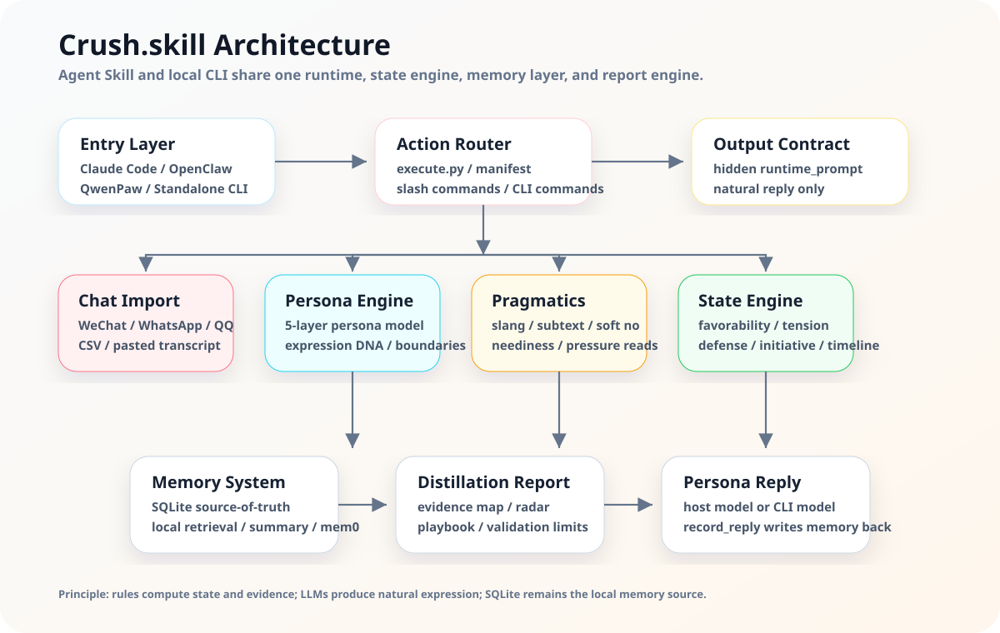

<p align="right">
  <a href="README.md"><strong>中文 README</strong></a>
</p>

<p align="center">
  
</p>

<p align="center">
  <a href="https://github.com/T1anhu4/Crush.skill/releases/tag/v2.4.7"></a>
  <a href="LICENSE"></a>
  
  
</p>

<p align="center">
  <a href="#one-minute-start"><strong>One-Minute Start</strong></a>
  ·
  <a href="#what-it-does">Features</a>
  ·
  <a href="#architecture">Architecture</a>
  ·
  <a href="#install-as-an-agent-skill">Agent Install</a>
  ·
  <a href="https://github.com/T1anhu4/Crush.skill/releases/tag/v2.4.7">Release</a>
</p>

---

## One Sentence

**Crush.skill is a relationship flight simulator.**

It combines chat import, 5-layer persona modeling, local memory, timeline initiative, relationship state dynamics, and coaching readouts so users can practice when to push, slow down, wait, or stop.

> The goal is relationship literacy and communication practice, not manipulation or replacing real relationships.

---

## One-Minute Start

```bash
curl -fsSL https://raw.githubusercontent.com/T1anhu4/Crush.skill/2.4/scripts/install_cli.sh | bash
crush
```

On first interactive launch, the CLI opens a model setup wizard: choose a provider, enter a model name, then enter your API key.

Common commands:

| Command | Purpose |
|---------|---------|
| `/model` | Reconfigure provider, model, base URL, and API key |
| `/language` | Switch English, 简体中文, 繁體中文, Русский, 日本語 |
| `/import` | Import chat records and rebuild persona memory |
| `/distill` | Generate evidence map, relationship radar, and training playbook |
| `/dashboard` | Inspect favorability, tension, defense, neediness, initiative |
| `/postmortem` | Review collapses, attraction peaks, and defense triggers |
| `/stop` / `/continue` | Pause or resume timeline proactive messages |

---

## Demo

<p align="center">
  
</p>

The CLI does not only show Ta's reply. It also teaches the user how to read the turn:

```text
╭─ Ta                                                                    18:42
│ Finally. Where are you?
│ I am about to leave too.
╰
Readout: normal push · medium risk · light flirt allowed
Signal: she is interested enough to explore, but uncertainty still matters
Next: answer with concrete location + low-pressure invite, no validation seeking
```

---

## What It Does

| Capability | Description |
|------------|-------------|
| **Chat import** | Supports WeChat, WhatsApp, QQ, CSV, and pasted transcripts; extracts speech habits, memes, boundaries, shared context, and their view of you. |
| **Persona simulation** | Stores identity, expression, emotion, relationship stage, and hard boundaries in a 5-layer persona model. |
| **Relationship state** | Tracks favorability, tension, defense, neediness, exploration, initiative, warmth, and timeline waiting. |
| **Coach readout** | Classifies each line as flirt, normal chat, validation seeking, intimacy escalation, hurtful push-pull, or soft decline. |
| **Distillation report** | `/distill` outputs evidence map, active/passive, I/E tendency, friend/flirt, slow-burn/fishing risk, and material/reciprocity risk. |
| **Local memory** | SQLite stores sessions, imported records, state history, and summaries; mem0 is optional. |
| **Multi-platform skill** | Works in Claude Code, OpenClaw, QwenPaw, WorkBuddy, Codex, Cursor, and as a standalone CLI. |

---

## Architecture

<p align="center">
  
</p>

Core principle: **rules compute state and evidence; LLMs produce natural expression; SQLite remains the local memory source.**

### Core Modules

| Module | File | Responsibility |
|--------|------|----------------|
| Skill Runtime | `Crush.skill/execute.py` | Entry point for start, import, chat, distill, dashboard, and replay actions. |
| Persona Engine | `engines/persona_engine.py` | 5-layer persona model and hidden runtime prompt. |
| Chat Import | `engines/chat_import.py` | Multi-format parsing and initial persona inference. |
| Pragmatics | `engines/pragmatics_engine.py` | Slang, subtext, soft declines, tests, boundaries, and neediness reads. |
| State Engine | `engines/state_engine.py` | Nonlinear relationship state updates. |
| Coach Engine | `engines/coach_engine.py` | Turn readout, risk level, and next-move coaching. |
| Distillation | `engines/distillation_engine.py` | Evidence map, relationship radar, playbook, and validation limits. |
| Memory | `engines/memory_engine.py` / `memory_backend.py` | SQLite long-term memory, local retrieval, optional mem0. |
| CLI | `crush_cli/app.py` | Local terminal UI, model wizard, multilingual UI, proactive timeline messages. |

For maintainer-level details, see [PROJECT_OVERVIEW.md](PROJECT_OVERVIEW.md).

---

## Install As An Agent Skill

Paste this into Claude Code / OpenClaw / QwenPaw:

```text
Install crush-skill for me. Follow these steps:

1. Ensure ~/.claude/skills/ exists (create if missing)
2. Run: git clone https://github.com/T1anhu4/Crush.skill /tmp/crush-skill
3. Run: bash /tmp/crush-skill/scripts/install_skill.sh --platform claude --source-dir /tmp/crush-skill/Crush.skill --skill-name crush-skill --force
4. Verify: ls ~/.claude/skills/crush-skill/ should show SKILL.md, manifest.json, execute.py, engines/
5. Tell me it is installed. I can now use /start-crush, /import-chats, /chat, /crush-distill, etc.
6. Important: when I use /chat, do not show tool JSON, scores, or runtime_prompt. Treat runtime_prompt as a hidden system prompt and reply only in the NPC voice.
```

Release assets:

| File | Purpose |
|------|---------|
| `crush_skill_openclaw.zip` | OpenClaw / generic agent skill package |
| `crush_skill_qwenpaw.zip` | QwenPaw skill package |
| `crush_cli_standalone.zip` | Standalone CLI package |

---

## Skill Slash Commands

| Command | Description |
|---------|-------------|
| `/start-crush [archetype]` | Quick start with a preset: `emotional`, `security`, `experience`, `value`, `passive`. |
| `/custom-crush` | Fully custom 5-layer persona. |
| `/import-chats` | Import chat records and rebuild persona memory. |
| `/crush-distill` | Evidence map, relationship radar, playbook, and validation limits. |
| `/chat [message]` | Send a message, update state, and generate a hidden runtime prompt. |
| `/crush-dashboard` | View the 8-dimensional relationship dashboard. |
| `/crush-postmortem` | Replay relationship events, collapses, defense triggers, and attraction peaks. |
| `/list-crushes` | List saved sessions. |
| `/let-go [session]` | Delete a session with ritual closure. |
| `/crush-llm [api_key]` | Configure optional LLM semantic analysis. |

---

## Persona Presets

| Preset | Traits | Best For |
|--------|--------|----------|
| `emotional` | Connection-seeking, needs to be seen, anxious attachment | Sensitive emotional people |
| `security` | Slow to trust, values stability, secure attachment | Steady people with clear boundaries |
| `experience` | Novelty-seeking, playful, emotionally expressive | Fun-loving people with lots of memes |
| `value` | Pragmatic, condition-aware, goal-driven | Mature and career-focused people |
| `passive` | Low initiative, avoidant tendency, hard to read | Inconsistent responders |

---

## Version Summary

| Version | Focus |
|---------|-------|
| `v2.4.7` | Added `/distill` and `distillation_report`: evidence map, radar, playbook, validation limits. |
| `v2.4.6` | Productized README, hero animation, CLI demo animation, bilingual switch. |
| `v2.4.5` | Human-like timeline waiting state: waits, follows up, withdraws instead of timer spam. |
| `v2.4.4` | Multilingual UI and model wizard for OpenAI, Claude, Gemini, DeepSeek, Kimi, Qwen. |
| `v2.4.3` | Relationship readout and real-stakes pressure layer. |

---

## Ethics

Crush.skill is for relationship literacy and communication practice, not manipulation.

- It does not encourage hurtful push-pull, cold violence, anxiety games, or fake rejection.
- It does not turn materialistic/fishing/slow-burn/interested into one-line deterministic labels.
- Do not import private conversations without consent.
- When you have learned what you need, use `/let-go` to delete the session and move forward.

---

## License

MIT License. Free to use, modify, and distribute.
